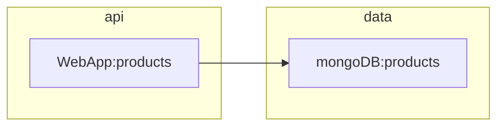

In the first two sessions, we have developed and demonstrated the mongodb and .NET web app. These have been shown running from a variety of deployments including mongo Atlas, local docker instances, local vs code .NET, and in azure.
