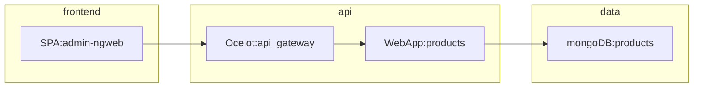

In the seventh session we introduce an Ocelot-based api gateway, and bring in a demo front end in the form of the admin Angular SPA.

```mermaid
graph LR
    SPA:admin-ngweb-->Ocelot:api_gateway
    subgraph frontend
    SPA:admin-ngweb
    end
    subgraph api
    Ocelot:api_gateway-->WebApp:products
    end
    subgraph data
    mongoDB:products
    end
    WebApp:products-->mongoDB:products
```