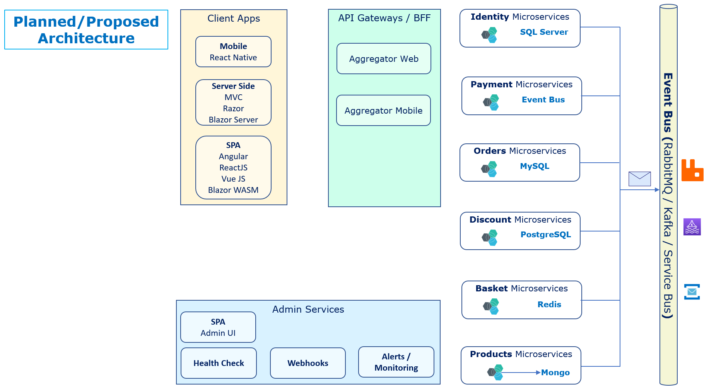

# eshop-main

Our main Project for eCommerce Shopping solution built on Microservices architecture.

## Architecture Diagram

## Related Project Repositories

> 1. [eShop Services Products](https://github.com/vishipayyallore/eshop-services-products)
> 1. [eShop Client Web Application in Angular 14](https://github.com/vishipayyallore/eshop-client-ngweb)
> 1. [eShop API Gateway Ocelot](https://github.com/vishipayyallore/eshop-apigateway-ocelot)
> 1. [eShop Services Identity](https://github.com/vishipayyallore/eshop-services-identity)
> 1. [eShop Admin Web Application in Angular 14](https://github.com/vishipayyallore/eshop-admin-ngweb)
> 1. [eShop Services Basket](https://github.com/vishipayyallore/eshop-services-basket)
> 1. [eShop API Client Web Status](https://github.com/vishipayyallore/eshop-client-webstatus)
> 1. [eShop Client Web Razor Pages](https://github.com/vishipayyallore/eshop-client-razorweb)
> 1. [eShop Client Web Reactjs](https://github.com/vishipayyallore/eshop-client-rjweb)

## Completed Session(s) Video(s) and Code(s)

> 1. Please watch [**Introduction** to eShop](https://www.youtube.com/watch?v=GB55gX4umNM) video series to **get the context**.
> 1. First step into Products Microservice [**Session1**.md](https://github.com/vishipayyallore/eshop-services-products/blob/main/Documentation/Sessions/Session1.md) and its [Video](https://www.youtube.com/watch?v=wQ0Xf4pKZaQ)
> 1. Please refer [**Session2**.md](https://github.com/vishipayyallore/eshop-services-products/blob/main/Documentation/Sessions/Session2.md) and [Video](https://www.youtube.com/watch?v=R8QIrph-rCI) for more details.
> 1. Please refer [**Session3**.md](https://github.com/vishipayyallore/eshop-services-products/blob/main/Documentation/Sessions/Session3.md) and [Video](https://www.youtube.com/watch?v=xst1bjb54JM) for more details.
> 1. Please refer [**Session4**.md](https://github.com/vishipayyallore/eshop-services-products/blob/main/Documentation/Sessions/Session4.md) and [Video](https://www.youtube.com/watch?v=G6dPdySKzbs) for more details.
> 1. Please refer [**Session5**.md](https://github.com/vishipayyallore/eshop-services-products/blob/main/Documentation/Sessions/Session5.md) and [Video](https://www.youtube.com/watch?v=LPI0VVM24KI) for more details.
> 1. Please refer [**Session6**.md](https://github.com/vishipayyallore/eshop-services-products/blob/main/Documentation/Sessions/Session6.md) and [Video](https://www.youtube.com/watch?v=FmMIF6_bGuw) for more details.
> 1. Please refer [**Session7**.md](https://github.com/vishipayyallore/eshop-services-products/blob/main/Documentation/Sessions/Session7.md) and [Video](https://www.youtube.com/watch?v=7abmbzh0ckA) for more details.
> 1. Please refer [**Session8**.md](https://github.com/vishipayyallore/eshop-services-products/blob/main/Documentation/Sessions/Session8.md) and [Video](https://www.youtube.com/watch?v=z5hxCeCowFM) for more details.
> 1. Please refer [**Session9**.md](https://github.com/vishipayyallore/eshop-services-products/blob/main/Documentation/Sessions/Session9.md) and [Video](https://www.youtube.com/watch?v=-aEf272gZBM) for more details.
> 1. Please refer [**Session10**.md](https://github.com/vishipayyallore/eshop-services-products/blob/main/Documentation/Sessions/Session10.md) and [Video](https://www.youtube.com/watch?v=9Z4tT84VAr4) for more details.

## Planned Future Sessions

### Saga - Infrastructure

- Session 10 => How to setup and execute the solution, and Recap of previous 9 sessions
  
### Saga - Client

- Session 11 => Angular Client Integrating with Products Micro Services WITHOUT Authentication. List of Products ONLY
  
- Session 12 => Deep Dive into Configuring the Angular Project for Development. Angular, TypeScript, ESLint, Angular Config, Environment, husky.

- Session 13 => separate design concerns:  introduce design system. (just colors, intrduce without covering code the header, profile)
  - introduce design system concept, compare/contrast with micro-frontend
  - show styles, header, (profile foreshadowing?)
  - intro to npm artifact
  
- Session 14 => design system integration:
  - flesh up the demo client repo a bit - create a proper routing and component for products.
  - repo as it exists / build script
  - introduce design system to client.

- Session 15 => Introduction to "Configuration Service", and Deep Dive [NodeJs]
  - intro configuration service
  - architecture overview

- Session 16 => deploy, integrate Configuration service
  - build and deploy scripts
  - integrate into client: render product images
  - update Containers: [ Mongodb/Products API, Configuration service ]

- Session 17 => deploy the client
  - (AKS), Gated, and CI Builds, and Release Pipelines using GitHub Actions. We should have 4 containers (Configuration service, MongoDB, Products Microservice, and Client Web App) in the AKS cluster.

- Session 18 => Recap of previous 7 sessions

### Saga - Multiple sources system

- Session 19 => api getway with ocelot
  - architecture overview
  - foreshadow identity service, profile service
  - project local
  
- Session 20 => api getway
  - build scripts
  - integrate the product api in api gateway
  - integrate the configuration service in api gateway
  - modify the configuration service settings
  - demonstration in client

- Session 21 => identity overview
  - architecture overview
  - database
  - project local
  -
- Session 22 => identity implementation
  - project
  - integration in configuration service
  - demonstration in client

- Session 23 => Profile service
  - architecture overview
  - database
  - JAVA, Hibernate, Springboot
  - note: working locally

- Session 24 => Profile service AKS containerization
  - AKS in repo
  - release in eshop-main
  - revise configuration to expose service
  - revise client to consume service

- Session 25 => Recap of sessions 19 to 24

### Saga - Code quality

- Session 26 => Deep Dive into Unit Testing the Products Micro Service using C#, and NUnit/XUnit/MSTest
  
- Session 27 => Deep Dive into Unit Testing the Angular Project using TypeScript, and JEST
  - JEST setup
  - show testing practices with products component
  - show integration with builds script

- Session 28 => Logging of Products Microservice. Also, Angualr Admin and Client. End-to-End Logging. Configruation of the Projects

> 1. `Session 10` => How to setup and execute the solution, and Recap of `previous 9` sessions
> 1. `Session 11` => **Angular Client** Integrating with Products Micro Services WITHOUT Authentication. List of Products ONLY. Deploying Angular Client as local Container.
> 1. `Session 12` => Deep Dive into Configuring the Anuglar Project for Development. Angular, TypeScript, ESLint, Angular Config, Environment, husky.
> 1. `Session 13` => Deep Dive into Unit Testing the Anuglar Project using TypeScript, and JEST
> 1. `Session 14` => Changes to Infrastructure (AKS), Gated, and CI Builds, and Release Pipelines using GitHub Actions. We should have **3 containers** (Mongodb Datastore, Products Microservice, and Client Web App) in the AKS cluster.
> 1. `Session 15` => **Angular Admin** Integrating with Products Micro Services WITHOUT Authentication. List of Products ONLY. Deploying Angular Admin as Container. Into AKS too.
> 1. `Session 16` => Angular Admin CRUD Operations Integrating with Products Micro Services WITHOUT Authentication.
> 1. `Session 17` => Changes to Infrastructure (AKS), Gated, and CI Builds, and Release Pipelines using GitHub Actions. We should have **4 containers** (Mongodb Datastore, Products Microservices, Client and Admin Web Apps) in the AKS cluster.
> 1. `Session 18` => Deep Dive into Unit Testing the Products Micro Service using C#, and NUnit/XUnit/MSTest
> 1. `Session 19` => Logging of Products Microservice. Also, Angualr Admin and Client. End-to-End Logging. Configruation of the Projects
> 1. `Session 20` => **Recap** of **`sessions 11 to 17`**
> 1. Build, and push to ACR, Products Micro Service
> 1. `Session 21` => Introduction to **Identity Microservice**, and `SQL Server` data store for Identity Microservice. Verify using the `Postman` tool.
> 1. `Session 22` => Deep Dive into **Identity Microservice** (Authentication/Authorization, Single Sign On) . Identity Under the hoods. Verify using the `Postman` tool.
> 1. `Session 23` => Integrating Angular Admin & Client with Identity, and pass tokens to Products Micro Services.
> 1. `Session 24 - A` => Logging Updates.
> 1. `Session 25 - B` => Changes to Infrastructure (AKS), Gated, and CI Builds, and Release Pipelines using GitHub Actions. We should have **6 containers** (Mongodb, SQL Server Datastores, Products, Identity Microservices, Client and Admin Web Apps) in the AKS cluster.
> 1. `Session 26` => **Recap** of **`sessions 19 to 21`**
> 1. `Session 27` => Deep dive into API Gateway, Ocelot, and its configuration. Verify using the `Postman` tool.
> 1. `Session 28` => Create API Gateway microservice using Ocelot, Configuring the `Products`, and `Identity` microservices route and updating Angular Client and Admin to talk to API Gateway.
> 1. `Session 29 - A` => Logging Updates.
> 1. `Session 30 - B` => Changes to Infrastructure (AKS), Gated, and CI Builds, and Release Pipelines using GitHub Actions. We should have **7 containers** (Mongodb, SQL Server Datastores, Products, Identity, API Gateway Microservices, Client and Admin Web Apps) in the AKS cluster.
> 1. `Session 31` => **Recap** of **`sessions 24 to 26`**
> 1. `Session 32` => Security of Products, and Identity Microservices. Only API Gateway can access the Products and Identity Microservices. Security of Mongodb, SQL Server Datastores, only Products and Identity Microservices can access them.
> 1. `Session 33` => Alerts and monitoring of Products, Identity, and API Gateway Microservice.
> 1. `Session 34` => Recap of **`sessions 28 to 29`**
> 1. `Session 35` => Deep dive into **Basket** microservice using Redis Cache.
> 1. `Session 36` => Changes to Angular Client application to add products into Cart using **Basket** microservice.

## Links to Documentation

> 1. [How To Run The Solution](./HowTos/HowToRunTheSolution.md)

## Folder Structure

### eshop-main project folder

### eshop-services-products project folder

